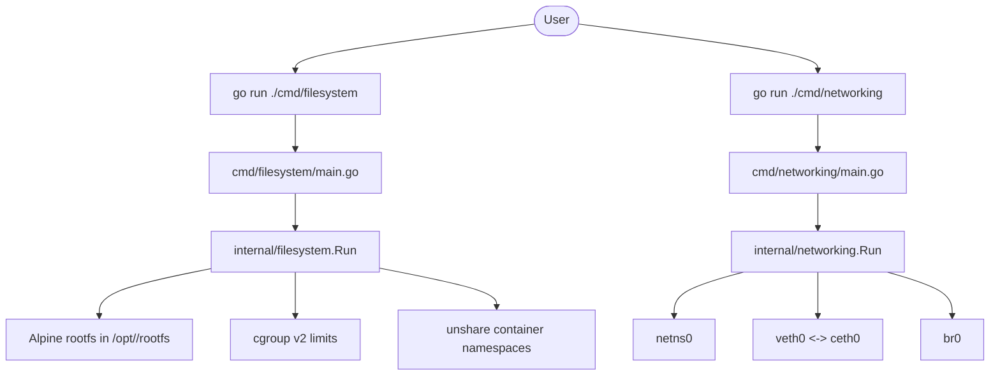
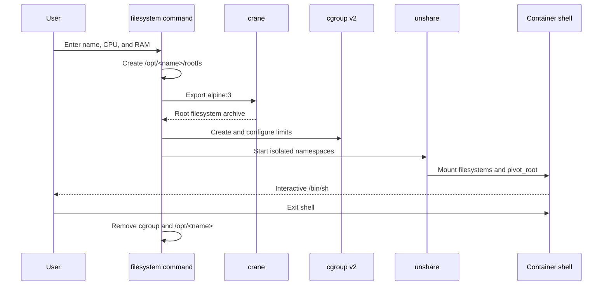
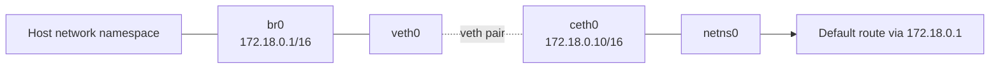

# Docker Go

Docker Go is a small Linux container runtime experiment written in Go. It demonstrates how to build a minimal container environment without using the Docker daemon:

- creates an Alpine Linux root filesystem;
- configures cgroup v2 CPU, memory, swap, and process limits;
- creates mount, PID, UTS, and cgroup namespaces with `unshare`;
- mounts `/dev`, `/proc`, and `/sys` inside the container;
- configures a network namespace, virtual Ethernet pair, and Linux bridge.

Filesystem setup and networking setup are intentionally exposed as two separate commands so each part can be developed independently.

> **Warning:** This project performs privileged operations under `/opt` and `/sys/fs/cgroup`. Run it only on a disposable Linux environment where you understand the effects of namespace, mount, cgroup, and network changes.

## Architecture



## Project layout

```text
.
├── cmd/
│   ├── filesystem/
│   │   └── main.go              # Filesystem command entry point
│   └── networking/
│       └── main.go              # Networking command entry point
├── internal/
│   ├── filesystem/
│   │   └── filesystem.go        # Rootfs, cgroups, namespaces, and cleanup
│   └── networking/
│       └── networking.go        # Network namespace, veth, bridge, and cleanup
├── go.mod
└── README.md
```

Each `cmd` package is a small entry point. The implementation lives in the corresponding `internal` package, keeping command startup separate from container functionality.

## Requirements

The project targets Linux with Go 1.23 or newer and requires:

- Linux kernel support for cgroup v2 and namespaces;
- root privileges, or equivalent capabilities;
- `bash`;
- `crane`;
- `tar`;
- `ip` from the `iproute2` package;
- `nsenter` from the `util-linux` package;
- `sudo` for the bind mounts used by the generated container script.

Verify the main external tools before running:

```bash
go version
crane version
ip -V
nsenter --version
mount --version
```

The host must have a cgroup v2 hierarchy mounted at `/sys/fs/cgroup`.

## Installation and build

Clone the repository and build both commands:

```bash
git clone <your-repository-url>
cd docker_go
go build ./...
```

Run the package checks:

```bash
go test ./...
```

## Running the filesystem command

Start the container filesystem setup:

```bash
sudo -E go run ./cmd/filesystem
```

The command asks for:

1. a container name;
2. a CPU percentage;
3. a RAM limit in megabytes.

For example:

```text
Entre the container name : alpine-demo
Entre the CPU percentage : 50
Entre the RAM (MB) : 256
```

The command then:

1. creates `/opt/alpine-demo/rootfs`;
2. exports `alpine:3` with `crane` and extracts it into the rootfs;
3. creates `/sys/fs/cgroup/alpine-demo`;
4. applies CPU, memory, swap, and process limits;
5. starts an isolated shell using `unshare`;
6. mounts the container's virtual filesystems and switches into the rootfs with `pivot_root`.



When the shell exits, the program attempts to remove the container cgroup and the `/opt/<name>` directory.

## Running the networking command

Set up the network namespace and bridge:

```bash
sudo -E go run ./cmd/networking
```

The current default topology is:

| Component | Value |
| --- | --- |
| Network namespace | `netns0` |
| Host-side veth | `veth0` |
| Namespace-side veth | `ceth0` |
| Namespace address | `172.18.0.10/16` |
| Bridge | `br0` |
| Bridge address | `172.18.0.1/16` |



If setup fails after creating resources, the command attempts to remove `netns0` and `br0`. These names are fixed in the current implementation, so do not run multiple networking instances at the same time.

## Important limitations

- The networking command is currently independent from the filesystem command; it does not automatically attach the container created by the filesystem command to `netns0`.
- Configuration values such as the Alpine image, namespace names, addresses, and bridge names are currently defined in the Go source.
- The filesystem command expects the host to permit privileged mount and namespace operations.
- The container script uses `sudo` for bind mounts, so configure sudo appropriately for the environment in which it is run.
- This is an educational runtime, not a production container engine. It does not provide image management, isolation auditing, persistent networking, or a security profile such as seccomp.

## Troubleshooting

### Permission denied

Run the command with root privileges and confirm that the host allows user namespaces, mounts, and cgroup administration.

### `crane: executable file not found`

Install `crane` and confirm it is available on `PATH`. The filesystem command uses it to download and export `alpine:3`.

### Cgroup files cannot be written

Confirm that cgroup v2 is mounted:

```bash
mount | grep cgroup2
ls /sys/fs/cgroup
```

### Network names already exist

Inspect and remove stale resources only after confirming they belong to this project:

```bash
ip netns list
ip link show br0
```

## License

Add the license for your repository here if you plan to publish this project.
